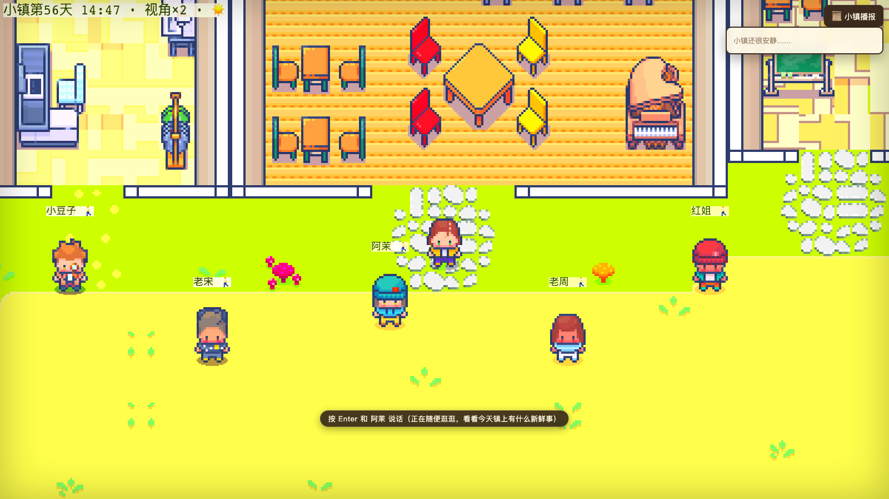

# 🏘️ AI 小镇（AI Town）

> 一个 AI 居民自主生活、社交的 2D 像素小镇。你以居民身份走进小镇，与 7 位有独立人设的 AI 居民自由对话，影响小镇的发展——**世界在你离开时也活着，居民记得你做过的事，故事是涌现而非剧本**。



*7 位 AI 居民按各自的日程在镇上自主活动；走近居民按 Enter 即可开始自由对话。*


不只是旁观 AI 社会的模拟，而是**亲自住进去**。与 Character.AI 类"一对一聊天框"的区别在于**世界感**——居民有自己的日程、会在路上偶遇聊天、会记得上周你帮忙试吃过新配方面包，第二天在广场和别的居民聊起你。

## ✨ 核心特性

| 特性 | 说明 |
|---|---|
| 🤖 **自主行为循环** | 感知 → 检索记忆 → 计划 → 行动。每天 07:00 每位居民生成当日计划，A\* 寻路自主移动，行为符合各自人设 |
| 🏠 **家具级感知与站位** | 居民的计划会落到具体家具——"看书"会被引导到书架旁、"排练"到驻唱台旁；播报里能看到"小豆子来到了合租公寓厨房，在冰箱旁"。全部零 LLM 成本 |
| 💬 **相遇涌现对话** | 居民相遇自动触发对话：一方邀请 → 另一方 LLM 决定接受/拒绝 → 逐回合状态机推进，路过的居民可以申请加入 |
| 🧠 **记忆流** | 一切皆记忆（对话/移动/事件/反思统一入库）。检索用三要素加权：时间近因 + 重要性 + 关键词命中，不上向量库 |
| 🌙 **每日反思** | 每天 23:00 用旗舰层模型复盘当日记忆，生成 1–2 条高层认知写回记忆流——关系与性格随时间自然生长 |
| 🎮 **玩家自由对话** | 走近居民输入任意文本（非预设选项），回应带记忆上下文与细粒度位置感知（"图书馆呢，就在书架旁"）；可插话进行中的群聊 |
| 🖥️ **全屏自适应** | 画布跟随窗口大小（Phaser RESIZE 模式）——窗口越大，同屏看到的镇子越大，像素风语义不变；配加载进度提示与左上角"小镇第 N 天 HH:MM"人话时间状态栏 |
| 🌃 **昼夜双面貌** | 5 档 ColorMatrix 昼夜调色 + 入夜后店铺/据点自动亮起暖色光圈（ADD 混合、程序生成零素材）；设置面板可一键关 |
| 💾 **世界连续存档** | 60s 自动存 + 停服存 + 启动读档：关掉重开，时钟、位置、进行中的计划全部连续，重启零 LLM 重烧 |
| 📜 **小镇播报 + 编年史** | 实时事件日志 UI 让"涌现"被看见；全部交互逐句全文落盘 `saves/chronicle.jsonl` |
| 🎭 **出戏防线** | 玩家试探"你是 AI 吗"时，居民以符合人设的方式困惑否认并岔开话题；LLM 超时降级为符合人设的托词而非报错 |
| 🖱️ **产品化前端** | 标题画面（萤火粒子 + 像素字体）→ 走进小镇转场；设置面板（文字速度/昼夜光照，localStorage 持久化）；对话卡逐字打印（可点击跳过）；居民头顶名牌像素字体渲染 + 防重叠自动错层；群聊时说话者头顶冒台词气泡 |
| 💰 **成本第一原则** | **事件驱动，居民无事可做时零 LLM 调用**；人设前缀逐字固定以吃满 Prompt 缓存（缓存读取价 = 输入价 1/5）。实测约 **¥0.76/游戏日**（预算 ¥2.1，达标 36%） |

### 小镇的居民

7 位居民各有姓名、职业、性格与关系网，人设定档入库（`residents` 表），照斯坦福 Generative Agents 的叙事体人设模板撰写（先天特质 / 后天特质 / 生活习惯三段式）：

- **沈青梧**（58，青梧咖啡老板娘）——晨型极早，四点半烘豆六点开门
- **慕容瑾**（52，九号酒馆老板）——夜型极晚，跑过二十年远洋货轮
- **高新**（30，酒馆驻唱歌手）——热烈直率，与室友周星星全靠冰箱便利贴交流
- **周星星**（26，画家）——安静敏感，白天泡在花园画速写
- **李算**（23，远程程序员）——社恐慢热，谁也不知道他偷偷统计室友开唱时间的程序存了两个 G
- **吴文**（61，退休语文教师）——全镇信息中枢，说话爱引课文
- **郑巧**（47，木匠兼杂货店主）——话少一诺千金，全镇的桌椅门窗大半出自她手

作息把 7 人天然分成晨型组与夜型组：清晨的咖啡馆、白天的花园与图书馆、入夜的九号酒馆——**昼夜双聚集点**让相遇密度全天在线。

## 🏗️ 架构

```
┌──────────────┐  WebSocket (world_state / player_move / player_chat / event_log)
│  Phaser 4 前端 │◄────────────────────────────────────────────►┌─────────────┐
│  TownScene    │                                              │   FastAPI    │
│  插值渲染/y-sort│                                              │   main.py    │
└──────────────┘                                              └──────┬──────┘
                                                                     │
                                                        ┌────────────▼─────────────┐
                                                        │      WorldEngine 主循环     │
                                                        │   （游戏时钟 1 现实秒=1 游戏分）│
                                                        └────────────┬─────────────┘
                             事件驱动：无事发生 = 零 LLM 调用                │
          ┌──────────────────────┬───────────────────────┬──────────────┴─────┐
          ▼                      ▼                       ▼                    ▼
    07:00 计划生成          居民相遇/玩家对话           23:00 每日反思      小镇编年史
    agents/planner.py      agents/dialogue.py        agents/reflection.py  world/chronicle.py
    （LLM 轻量层）          （对话状态机+LLM）          （LLM 旗舰层）       （纯落盘，零 LLM）
          │                      │                       │
          └──────────────────────┴───────────┬───────────┘
                                             ▼
                                  🧠 记忆流 memory/（SQLite）
                              store：一切皆记忆    retrieve：三要素加权 Top-K
                                             │
                                             ▼
                                  LLM 网关 llm/client.py
                            统一 chat(prompt, tier) 接口（MiniMax，OpenAI SDK 兼容）
                          轻量层 M2.7（对话/计划）· 旗舰层 M3（反思）· Prompt 缓存友好
```

**几个关键设计决策**（完整版见 [docs/TechDesign-AITown-MVP.md](docs/TechDesign-AITown-MVP.md)）：

1. **事件驱动而非逐 tick 调 LLM** —— 只有"到了生成计划的时刻 / 居民相遇 / 玩家说话 / 到了反思的时刻"这些离散事件才触发 LLM 调用。居民在地图上走路、播放动画全是确定性的本地逻辑，**成本下限是结构保证的，不是祈祷出来的**。
2. **人设前缀逐字固定** —— 每位居民的 prompt 以固定人设前缀开头（存 `residents.prompt_prefix`），保证 Prompt 缓存命中（MiniMax 缓存读取价 = 输入价 1/5）。改一个字都会毁掉缓存命中率。
3. **一切皆记忆** —— 对话摘要、移动观察、事件、反思统一进 `memories` 一张表，检索接口统一；而**逐句全文**另有编年史 `chronicle.jsonl` 落盘——摘要给"机器"检索用，全文给"人"回看用，职责分离。
4. **游戏主循环与 AI 循环解耦** —— 引擎每 1/3 秒一拍（移动/碰撞/广播），LLM 调用全部是后台 asyncio task，任何模型超时都有符合人设的降级托词兜底，游戏永不因 LLM 卡住。
5. **地图前后端共读** —— `town_map_v3.json` 是唯一事实源：前端渲染与后端 A\* 寻路共读同一份碰撞数据，永远不会出现"前端看见的路，后端认为走不通"。
6. **地图是管线产物而非手绘资产** —— the_ville 原图 140×100 裁剪 + sector 重命名 + 孤岛封闭 + 家具交互点提取，全部由转换脚本 `client/scripts/the_ville_src/convert_ville_map.py` 从源数据一次生成。挪窗口、改房名 = 改脚本重跑，walkable/站位/寻路测试自动重算。

## 🚀 快速开始

**前置要求**：Node.js ≥ 20、Python ≥ 3.12、[MiniMax 开放平台](https://platform.minimaxi.com/) API Key。仅桌面浏览器（Chrome/Safari），本地运行，不需要公网部署。

```bash
# 1. 克隆
git clone https://github.com/Rigel97/AITown.git
cd AITown

# 2. 配置 API Key（项目根目录创建 .env，已被 gitignore 永不入库）
echo "MINIMAX_API_KEY=你的key" > .env

# 3. 安装依赖
cd client && npm install && cd ..
cd server && pip install -r requirements.txt && cd ..

# 4. 一键启动（后端 :9000 + 前端 :5174）
./start.sh
```

打开 http://localhost:5174 即可进入小镇。

## 🎮 操作

| 按键 | 功能 |
|---|---|
| 方向键 | 移动 |
| `Enter` | 走近居民对话 / 插话进行中的群聊 |
| `Esc` | 关闭对话面板（分层：先关记录浮层再关对话卡） |
| `1` / `2` / `3` | 缩放 ×2 / ×1.5 / ×1 |
| `B` | 暖色滤镜开关 |

其他交互：左上角状态栏实时显示「小镇第 N 天 HH:MM」时间、视角倍率与昼夜光照图标（DOM 原生渲染，高分屏不模糊）；右上角「📜 小镇播报」实时滚动事件日志（按对话/时刻/动作分类着色）与「⚙ 设置」面板；居民头顶名牌用像素字体渲染并自动防重叠错层；群聊时说话者头顶冒出台词气泡；对话卡大立绘 + 台词逐字打印（点击可跳过）。画面自适应窗口大小——窗口拉大，看到的镇子越大。

## 📁 项目结构

```
AITown/
├── client/                  # Phaser 4 + Vite + TypeScript 前端
│   ├── src/scenes/          #   TitleScene（标题画面）/ TownScene：Tiled 地图渲染/插值/碰撞/相机
│   ├── src/ui/              #   HUD（对话卡/事件日志，DOM 层）
│   ├── src/net/             #   WebSocket 客户端（消息显式类型+运行时校验+指数退避重连）
│   ├── src/settings.ts      #   设置面板（文字速度/昼夜光照，localStorage 持久化）
│   ├── src/world/           #   地图数据类型/文案函数
│   └── scripts/             #   地图转换管线（the_ville 源数据 → 前后端共读 JSON）+ 美化后处理
├── server/                  # FastAPI 后端
│   ├── agents/              #   智能体循环：planner / dialogue / reflection / resident
│   ├── memory/              #   记忆流：store（写入+派生词表）/ retrieve（三要素检索）
│   ├── llm/                 #   LLM 网关：统一 chat(prompt, tier)，换 provider 只改这里
│   ├── world/               #   engine（主循环+站位防撞）/ clock / pathfinding / objects / chronicle / persistence
│   ├── db/                  #   schema.sql + seed.py（7 居民人设定档）
│   └── tests/               #   150 个 pytest 用例
└── saves/                   # 玩家存档区（gitignore）：记忆库 + chronicle.jsonl 编年史
```

## ✅ 测试

```bash
cd server && pytest          # 150 个用例：记忆检索/对话解析/寻路/家具感知/引擎/存档/WebSocket 集成/站位防撞
cd client && npm test        # vitest 27 个用例：设置持久化/网络重连退避/名牌布局/地图数据/对话文案
cd client && npm run lint    # ESLint（no-explicit-any 设为 error）
```

覆盖原则：记忆流三要素排序、对话解析白名单（挡旁白和 LLM 编造的第三人）、全站位点 A\* 互通、家具感知引导、编年史接线（每类交互至少一个用例锁死）。

## 🙏 素材致谢

- 小镇地图与室内瓦片：[Generative Agents](https://github.com/joonspk-research/generative_agents)（the_ville 地图，Apache-2.0），经 [GenerativeAgentsCN](https://github.com/x-glacier/GenerativeAgentsCN) 汉化版裁剪使用
- 部分装饰素材：[Kenney](https://kenney.nl/)（CC0）
- 架构灵感：Generative Agents 论文 *Generative Agents: Interactive Simulacra of Human Behavior*

## 🗺️ 路线图

- [x] Phase 1 骨架：地图/移动/时钟/WebSocket/MiniMax 打通
- [x] Phase 2 核心特性：自主行为循环、记忆流、相遇对话、玩家对话、播报与编年史
- [x] Phase 3 打磨：存档/读档、出戏防护、错误补全、成本实测校准（**实测 ¥0.76/游戏日 ≤ ¥2.1 目标**）
- [x] 地图大改版 v3：the_ville 122×35 室内小镇 + 家具语义化感知 + 前端 UI 美化
- [x] 显示体验打磨：全屏自适应画布（RESIZE）+ 加载进度提示 + 状态栏时间人话化
- [x] V3 居民落库：7 位新叙事体人设入库（seed 重写 + 存档重置 + 前端映射/立绘同步）
- [x] 体验与健壮性升级：标题画面/设置面板/对话逐字打印/名牌像素字体+防重叠/夜晚光圈/站位防撞（服务端动态避让）/记忆词表数据派生/重连退避
- [ ] 地图美化全量铺开（实验区已打样）+ V3 新立绘替换占位
- [ ] Phase 4 "上线"：朋友演示 + 连续 7 天主动玩验证

---

*这是个学习/作品集型项目——用最小可行架构验证"AI 居民自主生活"这件事。欢迎 Issue 交流。*
