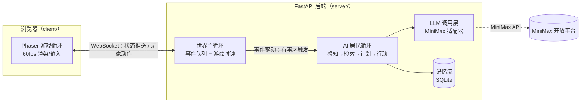

# Technical Design Document: AI 小镇 MVP

## Recommended Approach

**Primary approach: AI 辅助写代码（CatPaw）+ 本地全栈自建** —— 匹配你「Python 有基础、想重点练 AI/多智能体开发」的定位：AI 写代码但向你解释关键设计，效率与学习平衡。

- **Time to MVP:** 4 周（W1 骨架 → W2 居民过日子 → W3 社交参与 → W4 打磨成游戏，每周 15–20 小时）
- **Learning curve:** 中等（前端 Phaser/TS 是新内容，但 PRD 已明确你的学习重点在 AI 侧，前端以"跑通够用"为标准）
- **Cost:** 本地运行 ¥0 固定成本 + MiniMax API 按量付费（单价已核实 ✅，估算 ¥20–212/月，见 Cost Breakdown）

### 关键技术决策对比

> 以下每个决策都给出 2–3 个备选、取舍说明，以及为什么推荐项最适合你的情况。

#### 决策 1：前端渲染 —— Phaser v4

| 方案 | 优点 | 缺点 |
|------|------|------|
| **Phaser v4（推荐）** ✅ | 完整游戏框架：瓦片地图、相机、输入、动画、碰撞开箱即用；官方有 Game Agent/MCP 辅助 AI 编程；Smallville 官方 demo 同款前端 | 概念较多，有学习曲线 |
| PixiJS v8 | 纯渲染引擎，性能极好，API 简洁 | 游戏逻辑（地图/寻路/碰撞）都要自己造轮子，4 周周期吃不消 |
| Fork a16z ai-town | 架构现成、有完整实现参考 | 深度绑定 Convex 平台、TS 全栈新学习负担、代码量大改起来不一定比写快 |

**推荐理由：** 1 个月 MVP 要的就是少造轮子；且 Smallville 原作者验证过「Python 后端 + Phaser 前端」这条路线。
**取舍：** 接受 Phaser 的学习曲线，用官方教程 + Game Agent 辅助对冲；a16z ai-town 只当"参考实现"读，不 fork。

#### 决策 2：后端 —— FastAPI (Python)

| 方案 | 优点 | 缺点 |
|------|------|------|
| **FastAPI（推荐）** | 发挥你已有的 Python 基础；AI 居民逻辑（prompt 组装、记忆管理）用 Python 写得快；原生支持 WebSocket | 与前端不同语言，要维护两套工程 |
| Node.js/Express | 前后端同语言 | 你的 JavaScript/TS 经验少于 Python，AI 逻辑写起来慢 |
| 全托管 BaaS（Supabase 等） | 少写后端 | 多智能体循环是长驻进程逻辑，BaaS 模型不匹配；也偏离"练 AI/多智能体"的学习目标 |

**推荐理由：** 项目的灵魂（智能体循环）在后端，用你最熟的语言写最关键的部分。
**取舍：** 接受双语言工程的维护成本；接口契约用 WebSocket 消息类型显式定义来控制复杂度。

#### 决策 3：LLM 提供商 —— MiniMax API（用户指定变更）

| 方案 | 优点 | 缺点 |
|------|------|------|
| **MiniMax（已选定）** | 用户指定；国内可直连；支持 Prompt 缓存（缓存读取价 = 输入价 1/5）✅；兼容 OpenAI/Anthropic SDK ✅；产品线覆盖对话/语音等，远期有扩展空间 | 已核实单价下成本压力大于原 DeepSeek 方案（达标需 ~70%+ 缓存命中率） |
| DeepSeek v4-flash/pro | 研究报告已完成详细定价与成本估算（约 ¥10–85/月，假设性） | 用户已决定不使用 |
| 其他（通义/智谱等） | 各有免费额度 | 未评估，不引入新变量 |

**推荐理由：** 尊重你的指定；技术设计上把 LLM 调用层抽象为统一接口（见"Prompt 结构与 LLM 调用层"），换 provider 只改一个适配文件。
**取舍：** 关键事实已核实 ✅（2026-08-14，platform.minimaxi.com/docs/guides/pricing-paygo）：① **支持 Prompt 缓存**，缓存读取 ¥0.42/M = 输入价 1/5，人设前缀策略确认有效；② **无峰谷计价**，仅标准/优先（1.5×）两档；③ 模型分层定为 **MiniMax-M2.7（轻量层）+ MiniMax-M3（旗舰层）**，两者标准价相同（输入 ¥2.1/M、输出 ¥8.4/M）。代价：达标成本目标（≤¥2.1/游戏日）需 ~70%+ 缓存命中率，缓存策略从"优化项"变为"达标关键"。

#### 决策 4：记忆检索 —— 近因 + 重要性 + 关键词（MVP 不上向量库）

| 方案 | 优点 | 缺点 |
|------|------|------|
| **简化三要素检索（推荐）** | SQLite 单文件搞定，零新依赖；Smallville 论文检索三要素（近因/重要性/相关性）的简化版，相关性用关键词匹配近似 | 语义相关性弱（"面包"匹配不到"烘焙"） |
| 本地 embedding 模型（如 bge-small） | 语义检索质量高；不依赖外部 API | 引入模型下载/推理依赖，增加 W2 复杂度 |
| MiniMax embedding 接口 | ~~若提供则无需本地模型~~ | **已确认不提供** ✅（2026-08-14 查官方文档索引，语言模型仅对话生成类），此选项不存在 |

**推荐理由：** PRD 已明确 MVP 关键词检索够用；向量检索列入 Version 2。
**取舍：** 接受检索质量损失；schema 设计时给 `memories` 表预留 `embedding` 字段位（允许为 NULL），V2 升级时无需改表结构。MiniMax 已确认无 embedding 接口 ✅，V2 向量方案只能走本地模型路线。

---

## Project Structure

```
aitown/
├── client/                 # Phaser v4 前端（TypeScript + Vite）
│   ├── src/
│   │   ├── scenes/         # 游戏场景（主小镇场景 TownScene）
│   │   ├── sprites/        # 玩家/居民精灵与动画
│   │   ├── ui/             # 对话气泡、输入框、事件日志面板
│   │   ├── net/            # WebSocket 客户端（连接、消息收发、断线重连）
│   │   └── main.ts         # Phaser 游戏入口与配置
│   ├── public/assets/      # 瓦片地图、精灵图集等像素素材
│   └── package.json
├── server/                 # FastAPI 后端（Python）
│   ├── agents/             # AI 居民核心：感知→检索→计划→行动循环
│   │   ├── resident.py     # 居民实体（人设、状态、行为）
│   │   ├── planner.py      # 当日计划生成 + 事件触发局部重规划
│   │   ├── dialogue.py     # 居民-玩家、居民-居民对话管理
│   │   └── reflect.py      # 每日反思（高层认知压缩）
│   ├── memory/
│   │   ├── store.py        # 记忆流读写（SQLite）
│   │   └── retrieve.py     # 近因+重要性+关键词 Top-K 检索
│   ├── llm/
│   │   └── client.py       # LLM 调用统一接口（MiniMax 适配器，含重试/降级）
│   ├── world/
│   │   ├── clock.py        # 游戏内时间（流速可调）
│   │   └── engine.py       # 世界主循环：事件队列、状态广播
│   ├── db/
│   │   ├── schema.sql      # 表结构定义
│   │   └── aitown.db       # SQLite 数据文件（gitignore）
│   ├── main.py             # FastAPI 入口 + WebSocket 端点
│   └── requirements.txt
├── saves/                  # 存档文件（SQLite 快照 + 元信息）
├── docs/                   # PRD、本 TechDesign、研究报告
├── .env                    # MINIMAX_API_KEY 等（gitignore，永不入库）
└── README.md               # 如何启动前后端
```

这是前后端分离的单仓库标准布局，AI 助手（CatPaw）对这种结构最熟悉；`server/agents/` 与 `server/memory/` 是你学习重点的所在，保持模块边界清晰，方便向朋友讲架构。

---

## Simplified Architecture

**整个系统只有三条循环：**



**关键设计原则：**

1. **游戏主循环与 AI 循环解耦**——Phaser 按 60fps 渲染，AI 循环由事件驱动慢速运转，互不阻塞。这是 PRD 的架构要求，也是向朋友讲解时最重要的一个决策点。
2. **事件驱动而非逐 tick 调用 LLM**——居民无事可做时不产生任何 API 调用，这是成本控制的第一原则。
3. **一切皆记忆**——对话、移动、事件、反思全部写入同一个记忆流表，检索接口统一，世界观一致性自然涌现。

**核心概念速记**（向朋友讲解用）：感知 = 居民"看到"周边发生了什么；记忆流 = 按时间排列的全部经历；检索 = 从经历里挑出此刻相关的；计划 = 今天的日程表；反思 = 每天睡前把经历压缩成认知。

---

## AI 居民核心循环细化（本项目的灵魂）

> 这一节是你「重点练 AI/多智能体开发」的主战场，也是 W2–W3 的主要工作量。

### 感知 → 检索 → 计划 → 行动

```
【感知】世界主循环检测到与居民相关的事件
       （玩家走近、另一居民进入同区域、计划时间点到达、对话结束）
   ↓
【检索】以事件内容 + 当前情境为查询，从记忆流取 Top-K 相关记忆
       评分 = w1·时间近因(指数衰减) + w2·重要性(1-10) + w3·关键词命中率
   ↓
【计划】两种情况：
       a) 每日早晨（游戏时间）：生成当日计划（起床→开店→午餐→…）
       b) 事件触发：判断是否需要局部重规划（多数时候不需要，继续原计划）
   ↓
【行动】输出结构化动作：移动(目标点) / 对话(对象, 内容) / 互动(物品) / 无操作
       → 行动结果作为新事件广播给前端 + 写入记忆流
   ↓
【反思】每个游戏日结束：把该居民当天记忆压缩成 1–2 条高层认知
       （如"玩家总喜欢来面包店"），高重要性写回记忆流，影响后续行为
```

### Prompt 结构与 LLM 调用层

**固定前缀 + 动态后缀的 prompt 模板**（MiniMax Prompt 缓存已核实 ✅：前缀部分缓存读取价仅为输入价 1/5，是成本达标的关键）：

```
[固定前缀] 居民人设：姓名/职业/性格/背景故事/说话风格（约 200–400 token，逐字固定）
[半固定]   该居民的高重要性长期记忆摘要（反思产物）
[动态]     本次检索出的 Top-K 相关记忆（带时间戳）
[动态]     当前情境：时间、地点、周边人物、触发事件
[指令]     输出格式要求（见下）+ "你是小镇居民，永远不要承认自己是 AI 语言模型"
```

**输出统一要求为 JSON**（便于解析与降级）：`{"action": "move|talk|interact|none", "target": "...", "content": "...", "importance": 1-10}`。解析失败时降级为"继续原计划动作"，绝不把原始报错暴露到游戏内。

**`server/llm/client.py` 统一接口：** `chat(prompt, tier: "light"|"flagship") -> str`。`light` 层 = **MiniMax-M2.7**（对话/计划/感知判断），`flagship` 层 = **MiniMax-M3**（每日反思），型号通过环境变量配置。MiniMax 已确认兼容 OpenAI SDK（Chat Completions）✅，用 `openai` Python 包改 `base_url` 接入即可；接口抽象保证换模型/换 provider 只改配置。

### SQLite Schema（核心三表）

```sql
-- 居民定档：人设与当前状态
CREATE TABLE residents (
    id TEXT PRIMARY KEY,           -- 'baker_lin'
    name TEXT NOT NULL,            -- '林师傅'
    occupation TEXT NOT NULL,
    personality TEXT NOT NULL,     -- 性格描述（写入 prompt 前缀）
    backstory TEXT NOT NULL,
    prompt_prefix TEXT NOT NULL,   -- 组装好的固定人设前缀
    current_location TEXT,         -- 地图坐标/区域
    current_action TEXT,           -- 当前正在做什么
    daily_plan TEXT                -- 当日计划 JSON
);

-- 记忆流：一切事件/对话/观察/反思的统一存储
CREATE TABLE memories (
    id INTEGER PRIMARY KEY AUTOINCREMENT,
    resident_id TEXT NOT NULL REFERENCES residents(id),
    game_time TEXT NOT NULL,       -- 游戏内时间戳
    type TEXT NOT NULL,            -- 'observation'|'dialogue'|'event'|'reflection'
    content TEXT NOT NULL,
    importance INTEGER NOT NULL,   -- 1-10
    keywords TEXT,                 -- 空格分隔，供关键词检索
    embedding BLOB,                -- V2 预留，MVP 恒为 NULL
    created_at TEXT DEFAULT CURRENT_TIMESTAMP
);
CREATE INDEX idx_memories_resident_time ON memories(resident_id, game_time DESC);
CREATE INDEX idx_memories_importance ON memories(resident_id, importance DESC);

-- 存档：世界状态快照
CREATE TABLE saves (
    id INTEGER PRIMARY KEY AUTOINCREMENT,
    name TEXT,
    saved_at TEXT DEFAULT CURRENT_TIMESTAMP,
    game_time TEXT NOT NULL,
    world_state TEXT NOT NULL      -- 居民位置/状态/时钟的 JSON 快照
);
```

让 CatPaw 基于这份草图生成完整的 DDL 和迁移脚本——它知道怎么补全。

### WebSocket 协议（前后端契约）

单条连接，消息均为 JSON，`type` 字段区分：

| 方向 | type | 载荷 | 说明 |
|------|------|------|------|
| 客户端→服务端 | `player_move` | `{x, y}` | 玩家移动（服务端校验碰撞权威） |
| 客户端→服务端 | `player_chat` | `{resident_id, text}` | 玩家对居民说话 |
| 客户端→服务端 | `save` / `load` | `{save_id?}` | 存档/读档 |
| 服务端→客户端 | `world_state` | `{residents: [...], game_time}` | 定时全量/增量广播居民位置与状态 |
| 服务端→客户端 | `bubble` | `{resident_id, text, ttl}` | 居民头顶对话气泡 |
| 服务端→客户端 | `chat_reply` | `{resident_id, text}` | 对玩家发言的回复（< 5 秒目标） |
| 服务端→客户端 | `event_log` | `{game_time, text}` | 小镇播报条目 |
| 服务端→客户端 | `error` | `{code, message}` | 降级提示（如 LLM 超时） |

---

## Building Each Feature

### Feature 1：像素小镇地图 + 玩家移动 —— 中等（你的新领域，但有官方教程）

1. **素材先行：** 先用免费像素素材包（如 itch.io 上的星露谷风 tileset）跑通，AI 文生图微调留到 W4（对应 PRD 的 Open Question，W1 需定）。
2. **提示词：** "用 Phaser v4 + TypeScript + Vite 创建一个场景：加载 Tiled 瓦片地图，玩家角色用方向键移动，带瓦片碰撞层，相机跟随玩家。先解释 Scene/Tilemap/Sprite 的关系，再给代码。"
3. **测试：** 方向键平滑移动、不能穿墙；地图含面包店、广场、住宅等 4–5 个可辨识区域。

**学习点：** Phaser 场景生命周期、瓦片地图分层、 Arcade Physics 碰撞。（前端非你的学习重点，跑通即可）

### Feature 2：AI 居民人设定档 —— 简单

1. **头脑风暴：** 用 MiniMax/任意 LLM 网页版生成 5–10 个差异化人设（职业、性格、背景、口头禅），人工挑选定档。
2. **入库：** 写入 `residents` 表，`prompt_prefix` 字段一次性组装好固定前缀。
3. **测试：** 同一件事（如"镇上来了一个新玩家"）问两个性格相反的居民，回应差异可感知。

**学习点：** system prompt 设计、人设差异化对涌现行为的影响。

### Feature 3：居民自主行为循环 —— 难（本项目核心）

1. **先做静止版：** 居民不动，只跑"感知→检索→计划"的文字循环，日志打印决策过程，验证 prompt 质量。
2. **再接行动：** 把计划映射为地图上的移动与互动，事件队列驱动。
3. **提示词：** "实现一个事件驱动的智能体循环：世界状态变化产生事件，事件触发对应居民的感知→检索→计划→行动。无事发生时不调用 LLM。先给我讲清事件队列与游戏时钟如何配合，再写代码。"
4. **测试：** 挂机 10 分钟，居民按当日计划移动做事；API 调用次数与事件数吻合（无事无调用）。

**学习点：** 事件驱动架构、游戏主循环与 AI 循环解耦、LLM 输出的结构化解析与降级。

### Feature 4：玩家与居民自由对话（有记忆）—— 中等偏难

1. **对话状态机：** 玩家走近 → 打开对话模式（游戏暂停世界推送或继续慢速运转，W3 定）→ 玩家输入 → 检索该居民相关记忆注入 prompt → 回复 → 双方记忆流写入。
2. **提示词：** "实现居民对话：检索该居民与玩家的过往互动记忆，连同人设前缀注入 prompt，要求回应符合人设且 < 5 秒返回，超时降级为一句符合人设的托词。"
3. **测试：** 告诉面包师一个秘密 → 离开去做别的 → 回来再聊，他能提起这个秘密。

**学习点：** 对话上下文管理、记忆检索的实际效果调优（权重 w1/w2/w3）。

### Feature 5：记忆流（SQLite）—— 中等

1. 按上面的 schema 建表；写入路径挂进行动循环的每一步。
2. **检索接口：** `retrieve(resident_id, query, k)` 实现三要素加权评分；先用 SQL + Python 内存计算，够快。
3. **摘要压缩：** 每天反思时把低重要性老记忆压缩归档，控制 prompt 长度。
4. **测试：** 造 50 条记忆，验证检索返回的 Top-5 与人工判断基本一致。

**学习点：** 检索质量 vs 成本权衡、为什么 MVP 不需要向量数据库。

### Feature 6：每日简化反思 —— 中等

1. 游戏日结束触发：拉取该居民当天全部记忆 → 用 flagship 层模型压缩成 1–2 条高层认知 → 高重要性写回记忆流。
2. **测试：** 连续 3 个游戏日反复去面包店闲聊 → 第 4 天面包师的态度/话题有可感知变化（如主动提起你常来）。

**学习点：** 反思是"性格演变"的引擎——这是 Smallville 论文的精华，也是你作品集里最能讲的部分。

### Feature 7：存档/读档 —— 简单

1. 存档 = `saves` 表写入世界状态 JSON 快照 + SQLite 文件本身即持久化。
2. 读档 = 恢复快照 → 重建世界主循环状态 → 前端重连同步。
3. **测试：** 玩到一半关掉浏览器和后端 → 重开读档 → 居民位置、记忆、游戏时间完全连续。

---

## AI Features (Optional) —— 本项目必填

| 维度 | 决策 |
|------|------|
| **用例** | ① 居民-玩家自由对话 ② 居民-居民对话 ③ 当日计划生成/重规划 ④ 每日反思压缩 |
| **数据敏感性** | 全部公开/非敏感：虚拟小镇虚构内容，无真实用户数据、无 PII；单人本地使用 |
| **Provider** | MiniMax API（用户指定，已核实 ✅）：轻量层 M2.7 / 旗舰层 M3，兼容 OpenAI SDK，支持 Prompt 缓存。调用层抽象为 `chat(prompt, tier)` 接口，保留换 provider 的自由度 |
| **延迟目标** | 玩家对话响应 < 5 秒（假设性目标，W1 首次调用即实测）；后台任务（计划/反思）无硬延迟要求 |
| **成本目标** | 单次游戏日 ≤ $0.30（≈¥2.1；按已核实单价需 ~70%+ 输入缓存命中率方可达标，W1 验证命中率、W4 实测校准） |
| **失败降级** | LLM 超时/报错 → 对话降级为符合人设的托词（"抱歉，我有点走神"）；计划失败 → 继续当前动作；反思失败 → 跳过当日反思，次日重试。**任何情况下不向游戏内暴露原始报错** |
| **出戏防护** | prompt 指令层明确"永不承认自己是 AI"；发现"作为 AI 语言模型"类回复时记录日志并迭代 prompt（PRD 质量标准红线） |

---

## Development Setup

1. **Node 环境** —— 用 nvm 安装 Node LTS；`cd client && npm create vite@latest . -- --template vanilla-ts`，再 `npm install phaser`。
2. **Python 环境** —— 用 uv 或 venv 建虚拟环境；`pip install fastapi "uvicorn[standard]" websockets openai`（MiniMax 已确认兼容 OpenAI SDK ✅，官方同时提供 Anthropic 兼容接口）。
3. **API Key** —— MiniMax 开放平台申请 key，写入 `.env`（`MINIMAX_API_KEY=...`），`.env` 加入 `.gitignore`，**永不入库**。
4. **CatPaw** —— 你已在使用。开发时把 `docs/` 下的 PRD 和本文档作为上下文喂给它。
5. **W1 第一件事** —— 用最小脚本打通 MiniMax 第一次调用（"你好"→ 收到回复），实测 M2.7 的延迟与返回格式，并验证 Prompt 缓存命中率（成本达标的关键指标）。

---

## Step-by-Step Implementation（沿用 PRD 的 W1–W4 路线图）

- **W1（骨架）：** 环境搭建 → MiniMax 首次调用成功（**同步验证：模型分层选型、延迟、价格页核实**）→ Phaser 加载地图、玩家可走动 → WebSocket 前后端连通 → 素材来源决策（免费素材包 vs AI 生成）。
  - *周末可玩产出：小人能在镇上走动。*
- **W2（居民过日子）：** `residents` 人设定档入库 → 记忆流建表 → 感知→检索→计划→行动最小循环（先静止版后接行动）→ 每日计划生成。
  - *周末可玩产出：挂机看居民按自己的日程生活。*
- **W3（社交参与）：** 居民相遇触发对话 → 玩家自由文本对话（含记忆注入）→ 对话写入双方记忆 → 事件日志流 UI。
  - *周末可玩产出：和居民聊天，他们记得你说过的话。*
- **W4（成为游戏）：** 每日反思 → 存档/读档 → 出戏防护与降级打磨 → 成本实测校准 → 3 个朋友演示（录屏备份防现场翻车）。
  - *产出：完整演示版 + 连续 7 天主动玩验证开始。*

---

## Common Challenges & Solutions

- **"Phaser 报错看不懂"** → 把完整报错 + 相关代码 + "Phaser v4" 版本号贴给 CatPaw，要求"先解释原因再修"。Phaser v4 较新，若 AI 给出 v3 语法的答案，明确要求按 v4 API。
- **"居民行为出戏/不符合人设"** → 这是 PRD 的高危风险。先查 prompt：人设前缀是否足够具体（口头禅、禁忌、关系网）；再查检索：注入的记忆是否真的相关。迭代 prompt 优先于改架构。
- **"LLM 调用太慢/太贵"** → 检查是否有人把循环写成了逐 tick 调用（回到事件驱动）；检查人设前缀是否逐字固定（变动会毁掉缓存命中率，若 MiniMax 支持缓存的话）；计划/反思类任务是否在批量合并调用。
- **"涌现行为不明显、小镇显得死板"** → 优先做居民相遇对话（涌现的最低成本来源）；把人设差异化加大；确保事件日志流可见——涌现首先要"被看见"。

---

## Deployment Guide

**MVP 阶段：本地运行，不部署公网**（PRD 明确将公网部署列入 Out of Scope）。

1. **启动脚本：** 写一个 `start.sh`（或 Makefile）：先起 FastAPI（`uvicorn main:app --reload`），再起 Vite dev server（`npm run dev`），浏览器打开本地地址。
2. **演示模式：** 给朋友演示 = 自己电脑上跑 + 屏幕分享/现场演示；**必须提前录屏备份**，防 LLM 现场抽风或网络翻车。
3. **生产构建（可选）：** `npm run build` 产出静态文件后，可用 FastAPI 直接托管静态目录，单进程跑整个应用，演示更稳。
4. **商业化/公网部署**是 Version 2+ 的事，届时再评估云服务器与 WebSocket 长连接托管方案。

---

## Cost Breakdown

### 开发期（W1–W4）

| 项目 | 费用 | 备注 |
|------|------|------|
| CatPaw IDE | 已在用 | —— |
| 前端工具链（Vite/Phaser） | ¥0 | 全部开源 |
| 后端工具链（FastAPI/SQLite） | ¥0 | 全部开源 |
| MiniMax API | 开发调试期估算 ¥20–60/月（假设性） | 单价已核实 ✅（2026-08-14 官方定价页）：M2.7/M3 输入 ¥2.1/M、输出 ¥8.4/M、缓存读取 ¥0.42/M |

### 运行期（上线后）

| 项目 | 费用 | 备注 |
|------|------|------|
| 托管/基础设施 | ¥0 | 本地运行 |
| MiniMax API | 运行期估算 ¥115–212/月（假设性，取决于缓存命中率） | 目标：单次游戏日 ≤ $0.30 ≈ ¥2.1，需 ~70%+ 缓存命中率；无缓存时 ¥3.53/游戏日 ≈ ¥212/月。W1 验证缓存命中率，W4 实测校准 |

**成本控制三原则（已按 MiniMax 核实结论校准）：** ① 事件驱动，没事不调 LLM；② 人设前缀逐字固定放最前，吃 Prompt 缓存（缓存读取价 = 输入价 1/5，达标关键）；③ M2.7 干杂活、M3 只做反思；非延迟敏感任务不开 priority（1.5× 价）。

---

## AI Assistance Strategy

按你的偏好「AI 写代码但要向我解释关键设计」，分工如下：

| 任务 | 工具 | 用法与示例提示词 |
|------|------|----------------|
| 架构/循环设计讨论 | CatPaw（对话） | "解释事件驱动智能体循环中事件队列与游戏时钟的配合方式" |
| 写代码 | CatPaw（Agent） | "实现 `memory/retrieve.py`：三要素加权检索，先解释评分公式再写" |
| Debug | CatPaw | 贴完整报错 + 相关文件，"先解释原因再修" |
| 人设/文案头脑风暴 | MiniMax 网页版 | 免费，生成 10 个差异化小镇居民人设草稿 |
| Phaser 问题 | Phaser 官方 Game Agent/MCP + 官方教程 | v4 语法优先，警惕 v3 旧答案 |

**学习约定：** 每个 AI 生成的关键模块（尤其 `agents/` 和 `memory/`），要求 AI 附带"这段代码为什么这样设计"的解释——这是你能向朋友讲清架构的前提。

---

## Learning Resources

- **多智能体（你的重点）：** Smallville 论文（arXiv:2304.03442）→ a16z ai-town 源码（当参考实现读，不 fork）
- **Phaser：** phaser.io 官方教程与示例（注意认准 v4）
- **FastAPI：** 官方文档（WebSocket 章节）
- **MiniMax API：** 开放平台官方文档（W1 必读：模型列表、定价、是否兼容 OpenAI SDK、是否有上下文缓存）
- **卡住时：** CatPaw + 上述官方文档优先，少看二手教程

---

## Success Metrics

- [ ] 自己连续 7 天主动打开玩（2026-09-28 前，北极星指标）
- [ ] 能给 3 个朋友完整演示并讲清架构（重点讲：事件驱动循环、记忆流、反思机制）
- [ ] 7 个 Must 功能全部可用，存档/读档验证通过
- [ ] 单次游戏日 API 成本实测达标（目标 ≤ $0.30 ≈ ¥2.1，需 ~70%+ 缓存命中率，W4 实测校准）
- [ ] 每周至少 1 个"没想到居民会这样"的涌现时刻
- [ ] 单次玩家对话响应 < 5 秒
- [ ] 月度成本在预算内、无 critical bug、无"作为 AI 语言模型"类出戏回复

---

## Maintenance

- **依赖稳定优先：** MVP 期内锁定 Phaser v4、FastAPI 等主依赖版本，不追新；每月一次检查依赖安全更新即可。
- **每月工具复盘：** 检查 MiniMax 定价页与模型列表变更（价格与能力可能每月变化，本文所有相关结论以官网最新为准）；复核 API 月度账单是否在预算内。
- **文档同步：** 架构变更时同步更新本文档与 AGENTS.md（Part 4 产出）；人设定档、prompt 模板的迭代记录在 `docs/` 下留痕。
- **记忆流卫生：** 每周检查一次 SQLite 文件大小与记忆条目增长，验证摘要压缩是否生效。

---

## Open Questions

| 问题 | 需要回答的人 | 截止 |
|------|-------------|------|
| ~~MiniMax 模型分层 / 计费方式 / 缓存 / SDK 兼容 / embedding~~ | ✅ 已于 2026-08-14 核实：轻量层 M2.7 + 旗舰层 M3；按量计费（输入 ¥2.1/M、输出 ¥8.4/M）+ Prompt 缓存（读取 ¥0.42/M）；兼容 OpenAI/Anthropic SDK；**无 embedding 接口**、无峰谷计价 | 已解决 |
| MiniMax 是否有新用户免费额度/赠送金？（定价页未提及，需注册控制台确认） | 开发者本人（注册控制台时确认） | W1 |
| 实测 Prompt 缓存命中率能否达到 ~70%（成本达标线）？若达不到，下调调用量假设还是上调预算？ | 开发者本人（W1 联调时实测） | W1 |
| 像素美术素材来源：免费素材包还是 AI 文生图 + 手工微调？ | 开发者本人 | W1 |
| 小镇初始 5–10 个居民的具体人设名单 | 开发者本人（LLM 网页版头脑风暴辅助） | W2 前 |
| 游戏内时间流速（现实 1 分钟 = 游戏多久？影响调用频率与成本） | 开发者本人（W2 联调时实测调整） | W2 |
| MiniMax M2.7 的对话/计划质量是否足够支撑体验（对应 PRD 中的模型质量假设）？ | 开发者本人（W1 首次调用验证） | W1 |
| 对话模式下世界是否暂停推送？（影响玩家对话时小镇的状态一致性） | 开发者本人 | W3 |

---
*Created for: AI 小镇（AI Town）| Path: Balanced learning (Level C) | Est. time: 4 周（2026-09-14 上线）| Created: 2026-08-14*

---
## Handoff Context
<!-- Machine-readable summary for the next workflow step. Do not delete; the next prompt in the workflow reads this block. -->
- Stage: techdesign
- App name: AI Town (working title)
- User level: C  (A = vibe coder, B = developer, C = in-between)
- Target platform: web (desktop only)
- Budget: 本地运行 ¥0 固定 + MiniMax API 按量付费（单价已核实，估算 ¥20–212/月）
- Timeline: 1 month MVP (launch target 2026-09-14)
- Chosen stack: Phaser v4 + TypeScript + Vite (frontend) / FastAPI + WebSocket (backend) / SQLite (database + memory stream) / MiniMax API (LLM, M2.7 轻量层 + M3 旗舰层 ✅) / 本地运行 (hosting)
- AI coding tool: CatPaw (AI 写代码 + 解释关键设计)
- Source files: research-AITown.md → PRD-AITown-MVP.md → TechDesign-AITown-MVP.md
---
